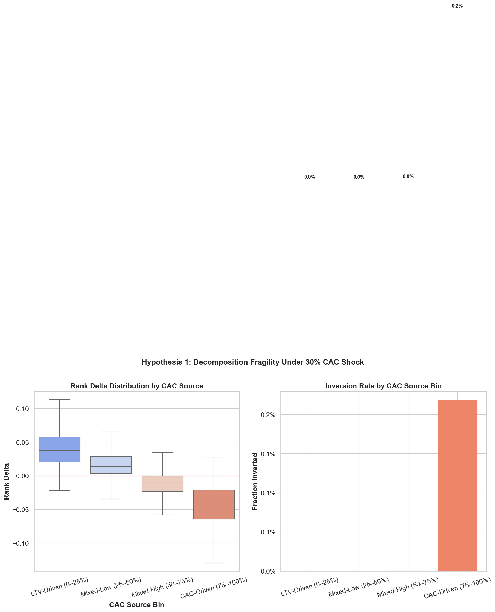
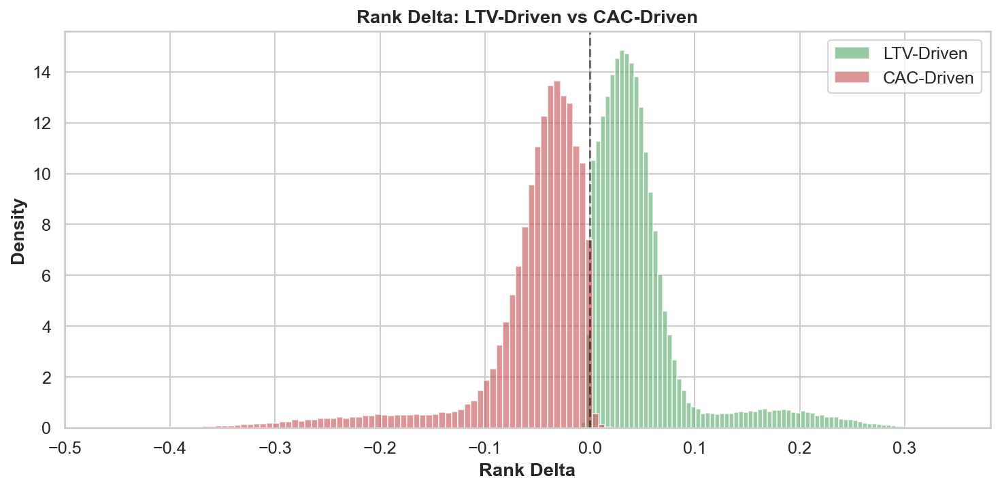
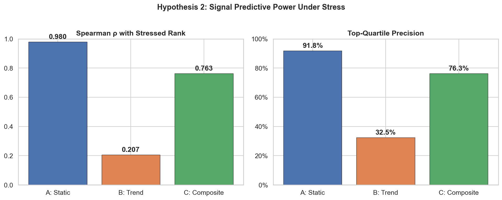
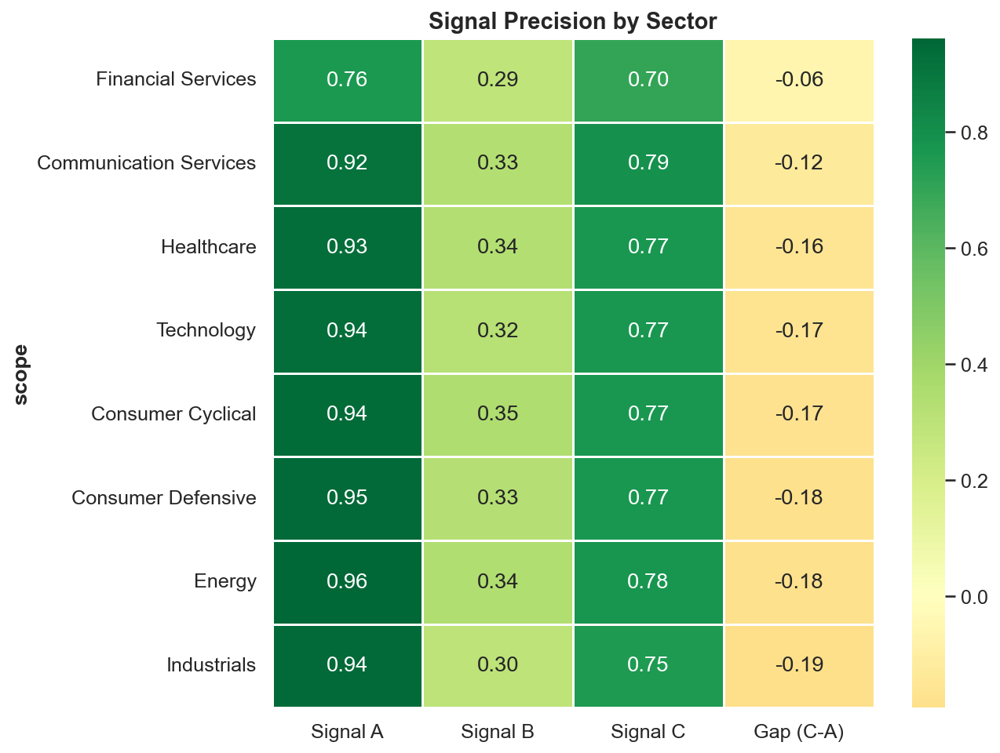

# LTV/CAC Decomposition Fragility

**Do companies with strong unit economics hide structural fragility?**

This experiment decomposes the LTV/CAC ratio to test whether companies whose favorable metrics are driven by *low customer acquisition costs* (rather than *high lifetime value*) exhibit greater rank instability under market stress — and whether ratio velocity adds predictive value beyond the static snapshot.

## Key Findings

### ✅ Hypothesis 1 — CAC-Driven Fragility: **Confirmed**

Companies whose LTV/CAC strength is driven by low CAC show significantly higher rank instability under a 30% acquisition cost shock. The effect is monotonic across all decomposition bins.

| CAC Source Bin | Mean Rank Δ | Inversion Rate |
|---|---|---|
| LTV-Driven (0–25%) | +0.049 | 0.000% |
| Mixed-Low (25–50%) | +0.020 | 0.000% |
| Mixed-High (50–75%) | −0.015 | 0.001% |
| **CAC-Driven (75–100%)** | **−0.055** | **0.218%** |

LTV-driven companies *gain* rank under stress as competitors fall around them. CAC-driven companies experience a ~10 percentile-point mean rank deterioration.

<p align="center">
  
</p>

<p align="center">
  
</p>

### ❌ Hypothesis 2 — Trend Signal Superiority: **Not Confirmed**

The static LTV/CAC ratio (Signal A) is the dominant predictor of stress resilience. Adding trend velocity (Signal C) dilutes top-quartile precision across all 8 sectors.

| Signal | Spearman ρ | Top-Quartile Precision |
|---|---|---|
| A: Static ratio | **0.980** | **91.8%** |
| B: Trend only | 0.450 | 50.3% |
| C: Composite (A+B) | 0.846 | 75.5% |

<p align="center">
  
</p>

<p align="center">
  
</p>

## Methodology

### Data Pipeline

1. **Real data** from [SEC EDGAR](https://www.sec.gov/edgar) XBRL API (no API key required)
   - 104 companies across 8 sectors, ~1,048 quarterly observations
   - Income statement fields: Revenue, Gross Profit, SG&A, S&M expenses
2. **Monte Carlo augmentation** to 500,000 observations per sector using Ledoit-Wolf covariance shrinkage
3. **Sector calibration** based on S&P 500 industry medians (Damodaran 2024)

### Stress Model — Dual Shock

The stress simulation applies two economically grounded channels:

```
Channel 1 — CAC Shock:    cac_stressed = cac × (1 + base × (1 + 3×cac_dep) + noise)
Channel 2 — LTV Erosion:  ltv_stressed = ltv × (1 − 0.40 × cac_dep^1.5 + noise)
```

**Resilience** is derived from fundamentals (`gross_margin`, `implied_churn`) — *not* from `ratio_trend`. This prevents circular reasoning between Signal B and the stress outcome.

### CAC Source Decomposition

Each company's LTV/CAC ratio is decomposed by how much of its strength comes from low CAC vs high LTV, using within-sector percentile rank of S&M intensity:

- **Low S&M intensity** → high `cac_source_pct` → ratio driven by below-average CAC
- **High S&M intensity** → low `cac_source_pct` → ratio driven by strong LTV (margin/retention)

### Integrity Constraints

- No circular dependency between trend signals and stress outcomes
- Inversion threshold: strict 75th→50th percentile definition
- Covariance estimation: Ledoit-Wolf shrinkage (not diagonal-only)
- Trend model: 40% fundamentals-quality + 20% ratio mean-reversion + 40% independent noise

## Quick Start

```bash
# Install dependencies
pip install -r requirements.txt

# Run with real SEC EDGAR data (no API key needed)
python experiment.py

# Run with cached data (skip EDGAR pull)
python experiment.py --use_cache

# Synthetic-only mode (no network required)
python experiment.py --synthetic_only

# Custom parameters
python experiment.py --n_companies 100000 --cac_shock 0.40
```

## Project Structure

```
├── experiment.py              # Main entrypoint
├── config.py                  # Experiment constants
├── requirements.txt
├── src/
│   ├── edgar_client.py        # SEC EDGAR XBRL API client
│   ├── data_pipeline.py       # Universe construction & data orchestration
│   ├── feature_engineering.py # LTV/CAC proxy construction from income statements
│   ├── monte_carlo.py         # Sector-calibrated Monte Carlo augmentation
│   ├── stress_simulation.py   # Dual shock model with fundamentals-based resilience
│   ├── signals.py             # Signal A (static), B (trend), C (composite)
│   ├── analysis.py            # Decomposition, signal comparison, sector heterogeneity
│   └── visualization.py       # Publication-quality plots
└── results/
    ├── experiment_summary.md  # Auto-generated findings
    ├── fragility_by_source.png
    ├── signal_comparison.png
    ├── sector_heatmap.png
    └── rank_delta_distribution.png
```

## Data Source

**SEC EDGAR XBRL API** — free, public, no API key required, 10 requests/second.

The client maps tickers to CIKs and fetches quarterly income statement data from Company Facts. It handles diverse XBRL taxonomies across sectors (e.g., banks use `NoninterestExpense` instead of `SGA`, energy companies use `CostOfRevenue` to derive gross profit).

## License

MIT
